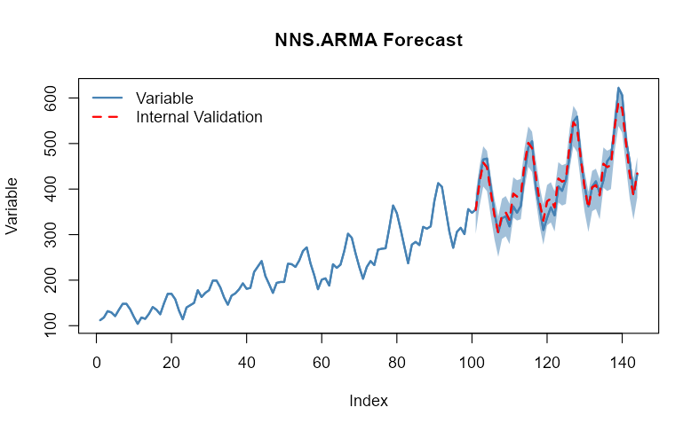
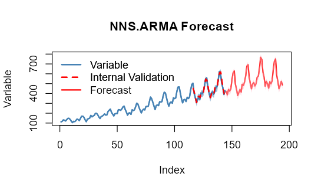

```{r setup, include=FALSE, message=FALSE}
knitr::opts_chunk$set(echo = TRUE)
library(NNS)
library(data.table)
data.table::setDTthreads(2L)
options(mc.cores = 1)
Sys.setenv("OMP_THREAD_LIMIT" = 2)
```

```{r setup2, message=FALSE, warning = FALSE}
library(NNS)
library(data.table)
require(knitr)
require(rgl)
```

# Forecasting

The underlying assumptions of traditional autoregressive models are well known. The resulting complexity with these models leads to observations such as,

*\`\`We have found that choosing the wrong model or parameters can often yield poor results, and it is unlikely that even experienced analysts can choose the correct model and parameters efficiently given this array of choices.''*

`NNS` simplifies the forecasting process. Below are some examples demonstrating **`NNS.ARMA`** and its **assumption free, minimal parameter** forecasting method.

## Linear Regression

**`NNS.ARMA`** has the ability to fit a linear regression to the relevant component series, yielding very fast results. For our running example we will use the `AirPassengers` dataset loaded in base R.

We will forecast 44 periods `h = 44` of `AirPassengers` using the first 100 observations `training.set = 100`, returning estimates of the final 44 observations. We will then test this against our validation set of `tail(AirPassengers,44)`.

Since this is monthly data, we will try a `seasonal.factor = 12`.

Below is the linear fit and associated root mean squared error (RMSE) using `method = "lin"`.

```{r linear,fig.width=5,fig.height=3,fig.align = "center", warning=FALSE}
nns_lin = NNS.ARMA(AirPassengers, 
               h = 44, 
               training.set = 100, 
               method = "lin", 
               plot = TRUE, 
               seasonal.factor = 12, 
               seasonal.plot = FALSE)

sqrt(mean((nns_lin - tail(AirPassengers, 44)) ^ 2))
```

## Nonlinear Regression

Now we can try using a nonlinear regression on the relevant component series using `method = "nonlin"`.

```{r nonlinear,fig.width=5,fig.height=3,fig.align = "center", eval = FALSE}
nns_nonlin = NNS.ARMA(AirPassengers, 
               h = 44, 
               training.set = 100, 
               method = "nonlin", 
               plot = FALSE, 
               seasonal.factor = 12, 
               seasonal.plot = FALSE)

sqrt(mean((nns_nonlin - tail(AirPassengers, 44)) ^ 2))
```

```{r nonlinearres, eval = FALSE}
[1] 18.15208
```

## Cross-Validation

We can test a series of `seasonal.factors` and select the best one to fit. The largest period to consider would be `0.5 * length(variable)`, since we need more than 2 points for a regression! Remember, we are testing the first 100 observations of `AirPassengers`, not the full 144 observations.

```{r seasonal test, eval=TRUE}
seas = t(sapply(1 : 25, function(i) c(i, sqrt( mean( (NNS.ARMA(AirPassengers, h = 44, training.set = 100, method = "lin", seasonal.factor = i, plot=FALSE) - tail(AirPassengers, 44)) ^ 2) ) ) ) )

colnames(seas) = c("Period", "RMSE")
seas
```

Now we know `seasonal.factor = 12` is our best fit, we can see if there's any benefit from using a nonlinear regression. Alternatively, we can define our best fit as the corresponding `seas$Period` entry of the minimum value in our `seas$RMSE` column.

```{r best fit, eval=TRUE}
a = seas[which.min(seas[ , 2]), 1]
```

Below you will notice the use of `seasonal.factor = a` generates the same output.

```{r best nonlinear,fig.width=5,fig.height=3,fig.align = "center", eval=TRUE}
nns = NNS.ARMA(AirPassengers, 
               h = 44, 
               training.set = 100, 
               method = "nonlin", 
               seasonal.factor = a, 
               plot = TRUE, seasonal.plot = FALSE)

sqrt(mean((nns - tail(AirPassengers, 44)) ^ 2))
```

**Note:** You may experience instances with monthly data that report `seasonal.factor` close to multiples of 3, 4, 6 or 12. For instance, if the reported `seasonal.factor = {37, 47, 71, 73}` use `(seasonal.factor = c(36, 48, 72))` by setting the `modulo` parameter in **`NNS.seas(..., modulo = 12)`**. The same suggestion holds for daily data and multiples of 7, or any other time series with logically inferred cyclical patterns. The nearest periods to that `modulo` will be in the expanded output.

```{r modulo, eval=TRUE}
NNS.seas(AirPassengers, modulo = 12, plot = FALSE)
```

## Cross-Validating All Combinations of `seasonal.factor`

NNS also offers a wrapper function **`NNS.ARMA.optim()`** to test a given vector of `seasonal.factor` and returns the optimized objective function (in this case RMSE written as `obj.fn = expression( sqrt(mean((predicted - actual)^2)) )`) and the corresponding periods, as well as the **`NNS.ARMA`** regression method used. Alternatively, using external package objective functions work as well such as `obj.fn = expression(Metrics::rmse(actual, predicted))`.

**`NNS.ARMA.optim()`** will also test whether to regress the underlying data first, `shrink` the estimates to their subset mean values, include a `bias.shift` based on its internal validation errors, and compare different `weights` of both linear and nonlinear estimates.

Given our monthly dataset, we will try multiple years by setting `seasonal.factor = seq(12, 60, 6)` every 6 months based on our **NNS.seas()** insights above.

```{r best optim, eval=FALSE}
nns.optimal = NNS.ARMA.optim(AirPassengers,
                             training.set = 100, 
                             seasonal.factor = seq(12, 60, 6),
                             obj.fn = expression( sqrt(mean((predicted - actual)^2)) ),
                             objective = "min",
                             pred.int = .95, plot = TRUE)

nns.optimal
```

```{r optimres, eval=FALSE}
[1] "CURRNET METHOD: lin"
[1] "COPY LATEST PARAMETERS DIRECTLY FOR NNS.ARMA() IF ERROR:"
[1] "NNS.ARMA(... method =  'lin' , seasonal.factor =  c( 12 ) ...)"
[1] "CURRENT lin OBJECTIVE FUNCTION = 35.3996540135277"
[1] "BEST method = 'lin', seasonal.factor = c( 12 )"
[1] "BEST lin OBJECTIVE FUNCTION = 35.3996540135277"
[1] "CURRNET METHOD: nonlin"
[1] "COPY LATEST PARAMETERS DIRECTLY FOR NNS.ARMA() IF ERROR:"
[1] "NNS.ARMA(... method =  'nonlin' , seasonal.factor =  c( 12 ) ...)"
[1] "CURRENT nonlin OBJECTIVE FUNCTION = 18.1435264878535"
[1] "BEST method = 'nonlin' PATH MEMBER = c( 12 )"
[1] "BEST nonlin OBJECTIVE FUNCTION = 18.1435264878535"
[1] "CURRNET METHOD: both"
[1] "COPY LATEST PARAMETERS DIRECTLY FOR NNS.ARMA() IF ERROR:"
[1] "NNS.ARMA(... method =  'both' , seasonal.factor =  c( 12 ) ...)"
[1] "CURRENT both OBJECTIVE FUNCTION = 20.8560044654062"
[1] "BEST method = 'both' PATH MEMBER = c( 12 )"
[1] "BEST both OBJECTIVE FUNCTION = 20.8560044654062"

$periods
[1] 12

$weights
NULL

$obj.fn
[1] 18.15208

$method
[1] "nonlin"

$shrink
[1] FALSE

$nns.regress
[1] FALSE

$bias.shift
[1] -8.576982

$errors
 [1]  -5.6787879  -5.2833333  -4.1616162 -17.7909091 -10.3838384  -8.8636364  -7.4526316   3.9393939   7.4882812  12.3750000  29.1132812  34.3281250  20.2205492
[14]  27.6022786  20.8336687  -8.4665838  30.8449534  12.9914773  17.5563939  38.3826941  19.2903993  17.4644272  19.3331767  19.8155057  -3.4480488  35.5619032
[27]  13.5978472 -16.1723154  12.1689345  -0.7539891  -5.0831451   5.9867956  -3.9068174  -0.7986170  42.1995863 -10.1324609 -19.3155737  19.8071364  -8.0478172
[40] -14.4690520   9.3426681 -20.0538349  -2.4281117  14.8998761

$results
 [1] 340.7442 408.1397 452.2614 440.6321 385.0392 329.5594 288.9704 331.3624 338.9113 321.7980 382.5363 373.7511 374.6436 454.0253 503.2567 487.9564 426.2680
[18] 363.4145 318.9794 366.8057 370.7134 350.8874 416.7562 407.2385 407.9750 498.9849 553.0209 534.2507 466.5920 397.6690 348.3399 402.4098 404.5162 381.6244
[35] 452.6226 442.2906 444.1074 546.2302 605.3752 582.9540 508.7657 432.3692 378.9949 438.3229

$lower.pred.int
 [1] 293.9961 361.3916 405.5133 393.8840 338.2911 282.8113 242.2223 284.6143 292.1632 275.0499 335.7882 327.0030 327.8955 407.2772 456.5086 441.2083 379.5199
[18] 316.6664 272.2313 320.0576 323.9653 304.1393 370.0081 360.4904 361.2269 452.2368 506.2727 487.5026 419.8438 350.9209 301.5918 355.6617 357.7681 334.8763
[35] 405.8745 395.5424 397.3593 499.4820 558.6271 536.2058 462.0176 385.6211 332.2468 391.5748

$upper.pred.int
 [1] 387.4923 454.8878 499.0095 487.3802 431.7873 376.3075 335.7185 378.1105 385.6594 368.5461 429.2844 420.4993 421.3917 500.7734 550.0048 534.7046 473.0161
[18] 410.1626 365.7275 413.5538 417.4615 397.6356 463.5043 453.9866 454.7231 545.7330 599.7690 580.9988 513.3401 444.4171 395.0880 449.1579 451.2643 428.3725
[35] 499.3707 489.0387 490.8556 592.9783 652.1233 629.7021 555.5138 479.1173 425.7430 485.0710

```

<center>

{width="600" height="400"}

</center>


## Extension of Estimates

We can forecast another 50 periods out-of-sample (`h = 50`), by dropping the `training.set` parameter while generating the 95% prediction intervals.

```{r extension,results='hide',fig.width=5,fig.height=3,fig.align = "center", eval=FALSE}
NNS.ARMA.optim(AirPassengers, 
                seasonal.factor = seq(12, 60, 6),
                obj.fn = expression( sqrt(mean((predicted - actual)^2)) ),
                objective = "min",
                pred.int = .95, h = 50, plot = TRUE)
```

<center>

{width="600" height="400"}

</center>

## Brief Notes on Other Parameters

-   `seasonal.factor = c(1, 2, ...)`

We included the ability to use any number of specified seasonal periods simultaneously, weighted by their strength of seasonality. Computationally expensive when used with nonlinear regressions and large numbers of relevant periods.

-   `weights`

Instead of weighting by the `seasonal.factor` strength of seasonality, we offer the ability to weight each per any defined compatible vector summing to 1.\
Equal weighting would be `weights = "equal"`.

-   `pred.int`

Provides the values for the specified prediction intervals within [0,1] for each forecasted point and plots the bootstrapped replicates for the forecasted points.

-   `seasonal.factor = FALSE`

We also included the ability to use all detected seasonal periods simultaneously, weighted by their strength of seasonality. Computationally expensive when used with nonlinear regressions and large numbers of relevant periods.

-   `best.periods`

This parameter restricts the number of detected seasonal periods to use, again, weighted by their strength. To be used in conjunction with `seasonal.factor = FALSE`.

-   `modulo`

To be used in conjunction with `seasonal.factor = FALSE`. This parameter will ensure logical seasonal patterns (i.e., `modulo = 7` for daily data) are included along with the results.

-   `mod.only`

To be used in conjunction with `seasonal.factor = FALSE & modulo != NULL`. This parameter will ensure empirical patterns are kept along with the logical seasonal patterns.

-   `dynamic = TRUE`

This setting generates a new seasonal period(s) using the estimated values as continuations of the variable, either with or without a `training.set`. Also computationally expensive due to the recalculation of seasonal periods for each estimated value.

-   `plot` , `seasonal.plot`

These are the plotting arguments, easily enabled or disabled with `TRUE` or `FALSE`. `seasonal.plot = TRUE` will not plot without `plot = TRUE`. If a seasonal analysis is all that is desired, `NNS.seas` is the function specifically suited for that task.

# Multivariate Time Series Forecasting

The extension to a generalized multivariate instance is provided in the following documentation of the **`NNS.VAR()`** function:

-   [Multivariate Time Series Forecasting: Nonparametric Vector Autoregression Using NNS](https://doi.org/10.2139/ssrn.3489550)

# References

If the user is so motivated, detailed arguments and proofs are provided within the following:

-   [Nonlinear Nonparametric Statistics: Using Partial Moments](https://github.com/OVVO-Financial/NNS/blob/NNS-Beta-Version/examples/index.md)

-   [Forecasting Using NNS](https://doi.org/10.2139/ssrn.3382300)

```{r threads, echo = FALSE}
Sys.setenv("OMP_THREAD_LIMIT" = "")
```